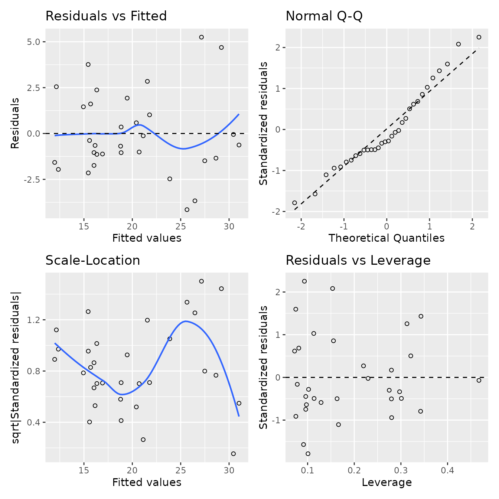

# Inference about Models

## Inference about a correlation

``` r
correlation_inference(mpg ~ wt + hp, data = mtcars2)
```

| response                                                                        | variable | correlation | conf.low | conf.high | p.value   |
|---------------------------------------------------------------------------------|----------|-------------|----------|-----------|-----------|
| mpg                                                                             | wt       | −0.868      | −0.934   | −0.744    | \< 0.0001 |
| mpg                                                                             | hp       | −0.78       | −0.89    | −0.59     | \< 0.0001 |
| Pearson's product-moment correlation (two.sided), with 95% confidence intervals |          |             |          |           |           |

## Model Creation

This code works with most linear or logistic models; it also has special
handling for models with a log-transformed response

Start by building the models in the usual way; here are three models.
All have both a categorical and a continuous explanatory variable, and
their interaction.

- A linear model
- A linear model with a log-transformed response
- A logistic model

``` r
m1 <- lm(mpg ~ wt * cyl, data = mtcars2)
m1_log <- lm(log(mpg) ~ wt * cyl, data = mtcars2)
m2 <- glm(am ~ mpg * cyl, data = mtcars2, family=binomial)
```

## Model Diagnostics

``` r
diag_plots(m1)
```



## ANOVA / Analysis of Deviance

``` r
model_anova(m1)
```

[TABLE]

``` r
model_anova(m1_log)
```

[TABLE]

``` r
model_anova(m2)
```

| (am = manual) ~ mpg \* cyl |     |       |         |
|----------------------------|-----|-------|---------|
| term                       | df  | chisq | p.value |
| mpg                        | 1   | 4.53  |   0.033 |
| cyl                        | 2   | 0.271 |   0.87  |
| mpg:cyl                    | 2   | 1.73  |   0.42  |

## Model summary values

``` r
model_glance(m1)
```

| mpg ~ wt \* cyl |           |               |       |           |        |      |      |          |             |      |           |
|-----------------|-----------|---------------|-------|-----------|--------|------|------|----------|-------------|------|-----------|
| df              | r.squared | adj.r.squared | sigma | statistic | logLik | AIC  | BIC  | deviance | df.residual | nobs | p.value   |
| 5               | 0.862     | 0.835         | 2.45  | 32.4      | -70.7  | 155  | 166  | 156      | 26          | 32   | \< 0.0001 |

``` r
model_glance(m2)
```

| (am = manual) ~ mpg \* cyl |         |        |      |      |          |             |      |
|----------------------------|---------|--------|------|------|----------|-------------|------|
| null.deviance              | df.null | logLik | AIC  | BIC  | deviance | df.residual | nobs |
| 43.2                       | 31      | -13.8  | 39.7 | 48.5 | 27.7     | 26          | 32   |

## Model coefficients

``` r
combine_tests(
  model_coefs(m1),
  model_coefs(m1_log),
  model_coefs(m2))
```

| group                      | term        | estimate | SE     | statistic | p.value   |
|----------------------------|-------------|----------|--------|-----------|-----------|
| mpg ~ wt \* cyl            | (Intercept) |  39.6    |  3.2   | 12.4      | \< 0.0001 |
|                            | wt          |  −5.6    |  1.4   | -4.15     |   0.0003  |
|                            | cyl6        | −11.2    |  9.4   | -1.19     |   0.24    |
|                            | cyl8        | −15.7    |  4.8   | -3.24     |   0.0032  |
|                            | wt:cyl6     |   2.9    |  3.1   |  0.920    |   0.37    |
|                            | wt:cyl8     |   3.5    |  1.6   |  2.12     |   0.043   |
| log(mpg) ~ wt \* cyl       | (Intercept) |   3.75   |  0.16  | 23.9      | \< 0.0001 |
|                            | wt          |  −0.212  |  0.067 | -3.16     |   0.0039  |
|                            | cyl6        |  −0.33   |  0.46  | -0.710    |   0.48    |
|                            | cyl8        |  −0.40   |  0.24  | -1.67     |   0.11    |
|                            | wt:cyl6     |   0.07   |  0.15  |  0.446    |   0.66    |
|                            | wt:cyl8     |   0.048  |  0.080 |  0.596    |   0.56    |
| (am = manual) ~ mpg \* cyl | (Intercept) | −11.0    |  8.3   | -1.33     |   0.18    |
|                            | mpg         |   0.48   |  0.35  |  1.38     |   0.17    |
|                            | cyl6        |  −9      | 18     | -0.496    |   0.62    |
|                            | cyl8        |   8.3    |  9.6   |  0.864    |   0.39    |
|                            | mpg:cyl6    |   0.49   |  0.85  |  0.584    |   0.56    |
|                            | mpg:cyl8    |  −0.42   |  0.47  | -0.897    |   0.37    |

## Model prediction intervals

``` r
model_predictions(m1, at=list(wt=c(2,3,4), cyl=c("4", "8")))
```

| mpg ~ wt \* cyl             |     |            |             |              |
|-----------------------------|-----|------------|-------------|--------------|
| wt                          | cyl | prediction | predict.low | predict.high |
| 2.00                        | 4   | 28.3       | 23.0        | 33.6         |
| 2.00                        | 8   | 19.5       | 13.1        | 25.9         |
| 3.00                        | 4   | 22.6       | 17.0        | 28.3         |
| 3.00                        | 8   | 17.3       | 11.8        | 22.8         |
| 4.00                        | 4   | 17.0       |  9.9        | 24.1         |
| 4.00                        | 8   | 15.1       |  9.9        | 20.3         |
| Prediction level used: 0.95 |     |            |             |              |

For log response models, model predictions and prediction intervals are
automatically backtransformed.

``` r
model_predictions(m1_log, at=list(wt=c(2,3,4), cyl=c("4", "8")))
```

| log(mpg) ~ wt \* cyl                                |     |            |             |              |
|-----------------------------------------------------|-----|------------|-------------|--------------|
| wt                                                  | cyl | prediction | predict.low | predict.high |
| 2.00                                                | 4   | 28.0       | 21.5        | 36.3         |
| 2.00                                                | 8   | 20.7       | 15.1        | 28.3         |
| 3.00                                                | 4   | 22.6       | 17.2        | 29.8         |
| 3.00                                                | 8   | 17.5       | 13.4        | 23.0         |
| 4.00                                                | 4   | 18.3       | 12.9        | 26.0         |
| 4.00                                                | 8   | 14.9       | 11.5        | 19.2         |
| Prediction level used: 0.95                         |     |            |             |              |
| Predictions are back-transformed from the log scale |     |            |             |              |

## Model means

For log response and logistic models, model means and confidence
intervals are automatically backtransformed. That is, to the original
scale from the log scale for log responses, and to the probability scale
from the log-odds scale for logistic models. To see results on the log
or logistic scale, use `backtransform = FALSE`.

### Linear Model

``` r
model_means(m1, ~1)
```

| mpg ~ wt \* cyl                              |        |      |     |          |           |
|----------------------------------------------|--------|------|-----|----------|-----------|
| 1                                            | emmean | SE   | df  | conf.low | conf.high |
| overall                                      | 19.23  | 0.67 | 26  | 17.86    | 20.60     |
| Results are averaged over the levels of: cyl |        |      |     |          |           |
| Confidence level used: 0.95                  |        |      |     |          |           |

``` r
model_means(m1, ~cyl)
```

| mpg ~ wt \* cyl                                                        |        |      |     |          |           |           |
|------------------------------------------------------------------------|--------|------|-----|----------|-----------|-----------|
| cyl                                                                    | emmean | SE   | df  | conf.low | conf.high | cld.group |
| 8                                                                      | 16.81  | 0.96 | 26  | 14.85    | 18.78     |  a        |
| 6                                                                      | 19.46  | 0.97 | 26  | 17.48    | 21.45     |  ab       |
| 4                                                                      | 21.4   | 1.5  | 26  | 18.4     | 24.4      |   b       |
| Confidence level used: 0.95                                            |        |      |     |          |           |           |
| P value adjustment: tukey method for comparing a family of 3 estimates |        |      |     |          |           |           |
| significance level used: alpha = 0.05                                  |        |      |     |          |           |           |
| NOTE: Results may be misleading due to involvement in interactions     |        |      |     |          |           |           |

``` r
pairwise_model_means(m1, ~cyl)
```

| mpg ~ wt \* cyl                                                           |          |     |     |          |           |         |         |
|---------------------------------------------------------------------------|----------|-----|-----|----------|-----------|---------|---------|
| contrast                                                                  | estimate | SE  | df  | conf.low | conf.high | t.ratio | p.value |
| cyl4 - cyl6                                                               | 1.9      | 1.8 | 26  | −2.4     | 6.3       | 1.10    |   0.52  |
| cyl4 - cyl8                                                               | 4.6      | 1.8 | 26  |  0.2     | 8.9       | 2.62    |   0.037 |
| cyl6 - cyl8                                                               | 2.7      | 1.4 | 26  | −0.7     | 6.0       | 1.95    |   0.15  |
| Confidence level used: 0.95                                               |          |     |     |          |           |         |         |
| Conf-level adjustment: tukey method for comparing a family of 3 estimates |          |     |     |          |           |         |         |
| P value adjustment: tukey method for comparing a family of 3 estimates    |          |     |     |          |           |         |         |
| NOTE: Results may be misleading due to involvement in interactions        |          |     |     |          |           |         |         |

``` r
model_means(m1, ~cyl | wt, at=list(wt=c(2,3,4)))
```

| mpg ~ wt \* cyl                                                        |     |        |      |     |          |           |           |
|------------------------------------------------------------------------|-----|--------|------|-----|----------|-----------|-----------|
| group                                                                  | cyl | emmean | SE   | df  | conf.low | conf.high | cld.group |
| wt = 2                                                                 | 8   | 19.5   | 1.9  | 26  | 15.6     | 23.4      |  a        |
|                                                                        | 6   | 22.8   | 3.3  | 26  | 16.1     | 29.6      |  ab       |
|                                                                        | 4   | 28.28  | 0.83 | 26  | 26.56    | 29.99     |   b       |
| wt = 3                                                                 | 8   | 17.3   | 1.1  | 26  | 15.0     | 19.6      |  a        |
|                                                                        | 6   | 20.07  | 0.98 | 26  | 18.05    | 22.09     |  ab       |
|                                                                        | 4   | 22.6   | 1.2  | 26  | 20.1     | 25.1      |   b       |
| wt = 4                                                                 | 8   | 15.10  | 0.65 | 26  | 13.75    | 16.44     |  a        |
|                                                                        | 4   | 17.0   | 2.4  | 26  | 12.0     | 22.0      |  a        |
|                                                                        | 6   | 17.3   | 2.6  | 26  | 11.9     | 22.7      |  a        |
| Confidence level used: 0.95                                            |     |        |      |     |          |           |           |
| P value adjustment: tukey method for comparing a family of 3 estimates |     |        |      |     |          |           |           |
| significance level used: alpha = 0.05                                  |     |        |      |     |          |           |           |

``` r
pairwise_model_means(m1, ~cyl | wt, at=list(wt=c(2,3,4)))
```

| mpg ~ wt \* cyl                                                           |             |          |     |     |          |           |         |          |
|---------------------------------------------------------------------------|-------------|----------|-----|-----|----------|-----------|---------|----------|
| group                                                                     | contrast    | estimate | SE  | df  | conf.low | conf.high | t.ratio | p.value  |
| wt = 2                                                                    | cyl4 - cyl6 |  5.4     | 3.4 | 26  | −3.0     | 13.8      |  1.61   |   0.26   |
|                                                                           | cyl4 - cyl8 |  8.8     | 2.1 | 26  |  3.6     | 14.0      |  4.23   |   0.0007 |
|                                                                           | cyl6 - cyl8 |  3.4     | 3.8 | 26  | −6.0     | 12.8      |  0.890  |   0.65   |
| wt = 3                                                                    | cyl4 - cyl6 |  2.6     | 1.6 | 26  | −1.3     |  6.5      |  1.64   |   0.25   |
|                                                                           | cyl4 - cyl8 |  5.3     | 1.6 | 26  |  1.2     |  9.4      |  3.24   |   0.0088 |
|                                                                           | cyl6 - cyl8 |  2.8     | 1.5 | 26  | −0.9     |  6.5      |  1.88   |   0.17   |
| wt = 4                                                                    | cyl4 - cyl6 | −0.3     | 3.6 | 26  | −9.3     |  8.6      | -0.0848 |   1.0    |
|                                                                           | cyl4 - cyl8 |  1.9     | 2.5 | 26  | −4.4     |  8.2      |  0.745  |   0.74   |
|                                                                           | cyl6 - cyl8 |  2.2     | 2.7 | 26  | −4.6     |  9.0      |  0.804  |   0.70   |
| Confidence level used: 0.95                                               |             |          |     |     |          |           |         |          |
| Conf-level adjustment: tukey method for comparing a family of 3 estimates |             |          |     |     |          |           |         |          |
| P value adjustment: tukey method for comparing a family of 3 estimates    |             |          |     |     |          |           |         |          |

### Linear Model, with log response

``` r
model_means(m1_log, ~cyl)
```

| log(mpg) ~ wt \* cyl                                                   |          |      |     |          |           |           |
|------------------------------------------------------------------------|----------|------|-----|----------|-----------|-----------|
| cyl                                                                    | response | SE   | df  | conf.low | conf.high | cld.group |
| 8                                                                      | 16.92    | 0.80 | 26  | 15.36    | 18.64     |  a        |
| 6                                                                      | 19.42    | 0.92 | 26  | 17.61    | 21.41     |  ab       |
| 4                                                                      | 21.6     | 1.6  | 26  | 18.6     | 25.1      |   b       |
| Confidence level used: 0.95                                            |          |      |     |          |           |           |
| Intervals are back-transformed from the log scale                      |          |      |     |          |           |           |
| P value adjustment: tukey method for comparing a family of 3 estimates |          |      |     |          |           |           |
| Tests are performed on the log scale                                   |          |      |     |          |           |           |
| significance level used: alpha = 0.05                                  |          |      |     |          |           |           |
| NOTE: Results may be misleading due to involvement in interactions     |          |      |     |          |           |           |

``` r
pairwise_model_means(m1_log, ~cyl)
```

| log(mpg) ~ wt \* cyl                                                      |       |       |     |          |           |      |         |         |
|---------------------------------------------------------------------------|-------|-------|-----|----------|-----------|------|---------|---------|
| contrast                                                                  | ratio | SE    | df  | conf.low | conf.high | null | t.ratio | p.value |
| cyl4 / cyl6                                                               | 1.113 | 0.096 | 26  | 0.898    | 1.380     | 1.00 | 1.24    |   0.44  |
| cyl4 / cyl8                                                               | 1.28  | 0.11  | 26  | 1.03     | 1.58      | 1.00 | 2.84    |   0.023 |
| cyl6 / cyl8                                                               | 1.148 | 0.077 | 26  | 0.972    | 1.355     | 1.00 | 2.05    |   0.12  |
| Confidence level used: 0.95                                               |       |       |     |          |           |      |         |         |
| Conf-level adjustment: tukey method for comparing a family of 3 estimates |       |       |     |          |           |      |         |         |
| Intervals are back-transformed from the log scale                         |       |       |     |          |           |      |         |         |
| P value adjustment: tukey method for comparing a family of 3 estimates    |       |       |     |          |           |      |         |         |
| Tests are performed on the log scale                                      |       |       |     |          |           |      |         |         |
| NOTE: Results may be misleading due to involvement in interactions        |       |       |     |          |           |      |         |         |

``` r
pairwise_model_means(m1_log, ~cyl, backtransform = FALSE)
```

| log(mpg) ~ wt \* cyl                                                      |          |       |     |          |           |         |         |
|---------------------------------------------------------------------------|----------|-------|-----|----------|-----------|---------|---------|
| contrast                                                                  | estimate | SE    | df  | conf.low | conf.high | t.ratio | p.value |
| cyl4 - cyl6                                                               | 0.107    | 0.086 | 26  | −0.108   | 0.322     | 1.24    |   0.44  |
| cyl4 - cyl8                                                               | 0.245    | 0.086 | 26  |  0.031   | 0.459     | 2.84    |   0.023 |
| cyl6 - cyl8                                                               | 0.138    | 0.067 | 26  | −0.029   | 0.304     | 2.05    |   0.12  |
| Results are given on the log (not the response) scale.                    |          |       |     |          |           |         |         |
| Confidence level used: 0.95                                               |          |       |     |          |           |         |         |
| Conf-level adjustment: tukey method for comparing a family of 3 estimates |          |       |     |          |           |         |         |
| P value adjustment: tukey method for comparing a family of 3 estimates    |          |       |     |          |           |         |         |
| NOTE: Results may be misleading due to involvement in interactions        |          |       |     |          |           |         |         |

``` r
model_means(m1_log, ~cyl, backtransform = FALSE)
```

| log(mpg) ~ wt \* cyl                                                   |        |       |     |          |           |           |
|------------------------------------------------------------------------|--------|-------|-----|----------|-----------|-----------|
| cyl                                                                    | emmean | SE    | df  | conf.low | conf.high | cld.group |
| 8                                                                      | 2.828  | 0.047 | 26  | 2.732    | 2.925     |  a        |
| 6                                                                      | 2.966  | 0.048 | 26  | 2.868    | 3.064     |  ab       |
| 4                                                                      | 3.073  | 0.072 | 26  | 2.925    | 3.221     |   b       |
| Results are given on the log (not the response) scale.                 |        |       |     |          |           |           |
| Confidence level used: 0.95                                            |        |       |     |          |           |           |
| P value adjustment: tukey method for comparing a family of 3 estimates |        |       |     |          |           |           |
| significance level used: alpha = 0.05                                  |        |       |     |          |           |           |
| NOTE: Results may be misleading due to involvement in interactions     |        |       |     |          |           |           |

### Logistic Model

``` r
model_means(m2, ~cyl)
```

| (am = manual) ~ mpg \* cyl                                             |      |      |          |           |           |
|------------------------------------------------------------------------|------|------|----------|-----------|-----------|
| cyl                                                                    | prob | SE   | conf.low | conf.high | cld.group |
| 8                                                                      | 0.18 | 0.25 | 0.01     | 0.86      |  a        |
| 4                                                                      | 0.21 | 0.24 | 0.01     | 0.83      |  a        |
| 6                                                                      | 0.48 | 0.23 | 0.13     | 0.84      |  a        |
| Confidence level used: 0.95                                            |      |      |          |           |           |
| Intervals are back-transformed from the logit scale                    |      |      |          |           |           |
| P value adjustment: tukey method for comparing a family of 3 estimates |      |      |          |           |           |
| Tests are performed on the log odds ratio scale                        |      |      |          |           |           |
| significance level used: alpha = 0.05                                  |      |      |          |           |           |
| NOTE: Results may be misleading due to involvement in interactions     |      |      |          |           |           |

``` r
pairwise_model_means(m2, ~cyl)
```

| (am = manual) ~ mpg \* cyl                                                |            |      |          |           |      |         |         |
|---------------------------------------------------------------------------|------------|------|----------|-----------|------|---------|---------|
| contrast                                                                  | odds.ratio | SE   | conf.low | conf.high | null | z.ratio | p.value |
| cyl4 / cyl6                                                               | 0.29       | 0.51 | 0.01     |  16.85    | 1.00 | -0.709  |   0.76  |
| cyl4 / cyl8                                                               | 1.2        | 2.7  | 0.0      | 228.5     | 1.00 |  0.0805 |   1.0   |
| cyl6 / cyl8                                                               | 4.1        | 7.8  | 0.0      | 362.4     | 1.00 |  0.734  |   0.74  |
| Confidence level used: 0.95                                               |            |      |          |           |      |         |         |
| Conf-level adjustment: tukey method for comparing a family of 3 estimates |            |      |          |           |      |         |         |
| Intervals are back-transformed from the log odds ratio scale              |            |      |          |           |      |         |         |
| P value adjustment: tukey method for comparing a family of 3 estimates    |            |      |          |           |      |         |         |
| Tests are performed on the log odds ratio scale                           |            |      |          |           |      |         |         |
| NOTE: Results may be misleading due to involvement in interactions        |            |      |          |           |      |         |         |

``` r
model_means(m2, ~cyl, backtransform=FALSE)
```

| (am = manual) ~ mpg \* cyl                                             |        |      |          |           |           |
|------------------------------------------------------------------------|--------|------|----------|-----------|-----------|
| cyl                                                                    | emmean | SE   | conf.low | conf.high | cld.group |
| 8                                                                      | −1.5   | 1.7  | −4.8     | 1.8       |  a        |
| 4                                                                      | −1.3   | 1.5  | −4.2     | 1.6       |  a        |
| 6                                                                      | −0.10  | 0.90 | −1.87    | 1.67      |  a        |
| Results are given on the logit (not the response) scale.               |        |      |          |           |           |
| Confidence level used: 0.95                                            |        |      |          |           |           |
| Results are given on the log odds ratio (not the response) scale.      |        |      |          |           |           |
| P value adjustment: tukey method for comparing a family of 3 estimates |        |      |          |           |           |
| significance level used: alpha = 0.05                                  |        |      |          |           |           |
| NOTE: Results may be misleading due to involvement in interactions     |        |      |          |           |           |

``` r
pairwise_model_means(m2, ~cyl, backtransform=FALSE)
```

| (am = manual) ~ mpg \* cyl                                                |          |     |          |           |         |         |
|---------------------------------------------------------------------------|----------|-----|----------|-----------|---------|---------|
| contrast                                                                  | estimate | SE  | conf.low | conf.high | z.ratio | p.value |
| cyl4 - cyl6                                                               | −1.2     | 1.7 | −5.3     | 2.8       | -0.709  |   0.76  |
| cyl4 - cyl8                                                               |  0.2     | 2.2 | −5.1     | 5.4       |  0.0805 |   1.0   |
| cyl6 - cyl8                                                               |  1.4     | 1.9 | −3.1     | 5.9       |  0.734  |   0.74  |
| Results are given on the log odds ratio (not the response) scale.         |          |     |          |           |         |         |
| Confidence level used: 0.95                                               |          |     |          |           |         |         |
| Conf-level adjustment: tukey method for comparing a family of 3 estimates |          |     |          |           |         |         |
| P value adjustment: tukey method for comparing a family of 3 estimates    |          |     |          |           |         |         |
| NOTE: Results may be misleading due to involvement in interactions        |          |     |          |           |         |         |

## Model slopes

For continuous explanatory variables, the slopes can be obtained and
compared in a similar way.

``` r
model_slopes(m1, wt~1)
```

| mpg ~ wt \* cyl                              |          |     |     |          |           |         |          |
|----------------------------------------------|----------|-----|-----|----------|-----------|---------|----------|
| 1                                            | wt.trend | SE  | df  | conf.low | conf.high | t.ratio | p.value  |
| overall                                      | −3.5     | 1.1 | 26  | −5.8     | −1.3      | -3.27   |   0.0030 |
| Results are averaged over the levels of: cyl |          |     |     |          |           |         |          |
| Confidence level used: 0.95                  |          |     |     |          |           |         |          |

``` r
model_slopes(m1, wt~cyl)
```

| mpg ~ wt \* cyl                                                        |          |      |     |          |           |         |          |           |
|------------------------------------------------------------------------|----------|------|-----|----------|-----------|---------|----------|-----------|
| cyl                                                                    | wt.trend | SE   | df  | conf.low | conf.high | t.ratio | p.value  | cld.group |
| 4                                                                      | −5.6     | 1.4  | 26  | −8.4     | −2.9      | -4.15   |   0.0003 |  a        |
| 6                                                                      | −2.8     | 2.8  | 26  | −8.5     |  3.0      | -0.991  |   0.33   |  a        |
| 8                                                                      | −2.19    | 0.89 | 26  | −4.03    | −0.35     | -2.45   |   0.021  |  a        |
| Confidence level used: 0.95                                            |          |      |     |          |           |         |          |           |
| P value adjustment: tukey method for comparing a family of 3 estimates |          |      |     |          |           |         |          |           |
| significance level used: alpha = 0.05                                  |          |      |     |          |           |         |          |           |

``` r
pairwise_model_slopes(m1, wt~cyl)
```

| mpg ~ wt \* cyl                                                           |          |     |     |          |           |         |         |
|---------------------------------------------------------------------------|----------|-----|-----|----------|-----------|---------|---------|
| contrast                                                                  | estimate | SE  | df  | conf.low | conf.high | t.ratio | p.value |
| cyl4 - cyl6                                                               | −2.9     | 3.1 | 26  | −10.6    | 4.9       | -0.920  |   0.63  |
| cyl4 - cyl8                                                               | −3.5     | 1.6 | 26  |  −7.5    | 0.6       | -2.12   |   0.10  |
| cyl6 - cyl8                                                               | −0.6     | 2.9 | 26  |  −7.9    | 6.7       | -0.200  |   0.98  |
| Confidence level used: 0.95                                               |          |     |     |          |           |         |         |
| Conf-level adjustment: tukey method for comparing a family of 3 estimates |          |     |     |          |           |         |         |
| P value adjustment: tukey method for comparing a family of 3 estimates    |          |     |     |          |           |         |         |

For log-response or logistic models, no back-transformation is done.

``` r
model_slopes(m1_log, wt~cyl)
```

| log(mpg) ~ wt \* cyl                                                   |          |       |     |          |           |         |          |           |
|------------------------------------------------------------------------|----------|-------|-----|----------|-----------|---------|----------|-----------|
| cyl                                                                    | wt.trend | SE    | df  | conf.low | conf.high | t.ratio | p.value  | cld.group |
| 4                                                                      | −0.212   | 0.067 | 26  | −0.349   | −0.074    | -3.16   |   0.0039 |  a        |
| 8                                                                      | −0.164   | 0.044 | 26  | −0.255   | −0.074    | -3.73   |   0.0009 |  a        |
| 6                                                                      | −0.14    | 0.14  | 26  | −0.43    |  0.14     | -1.04   |   0.31   |  a        |
| Confidence level used: 0.95                                            |          |       |     |          |           |         |          |           |
| P value adjustment: tukey method for comparing a family of 3 estimates |          |       |     |          |           |         |          |           |
| significance level used: alpha = 0.05                                  |          |       |     |          |           |         |          |           |

``` r
model_slopes(m2, mpg~cyl)
```

| (am = manual) ~ mpg \* cyl                                             |           |      |          |           |         |         |           |
|------------------------------------------------------------------------|-----------|------|----------|-----------|---------|---------|-----------|
| cyl                                                                    | mpg.trend | SE   | conf.low | conf.high | z.ratio | p.value | cld.group |
| 8                                                                      | 0.06      | 0.32 | −0.56    | 0.68      | 0.185   |   0.85  |  a        |
| 4                                                                      | 0.48      | 0.35 | −0.20    | 1.17      | 1.38    |   0.17  |  a        |
| 6                                                                      | 0.98      | 0.77 | −0.53    | 2.49      | 1.27    |   0.21  |  a        |
| Confidence level used: 0.95                                            |           |      |          |           |         |         |           |
| P value adjustment: tukey method for comparing a family of 3 estimates |           |      |          |           |         |         |           |
| significance level used: alpha = 0.05                                  |           |      |          |           |         |         |           |
