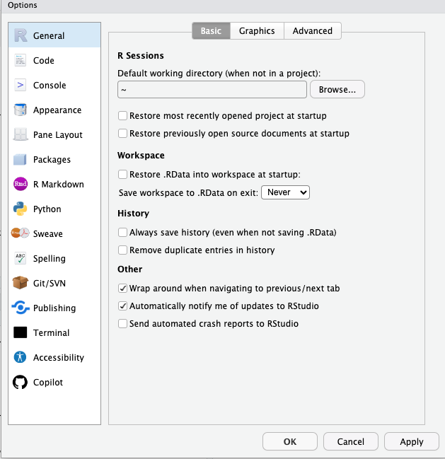
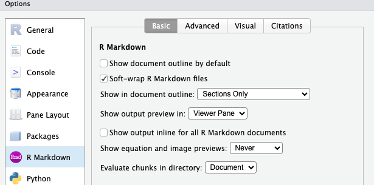
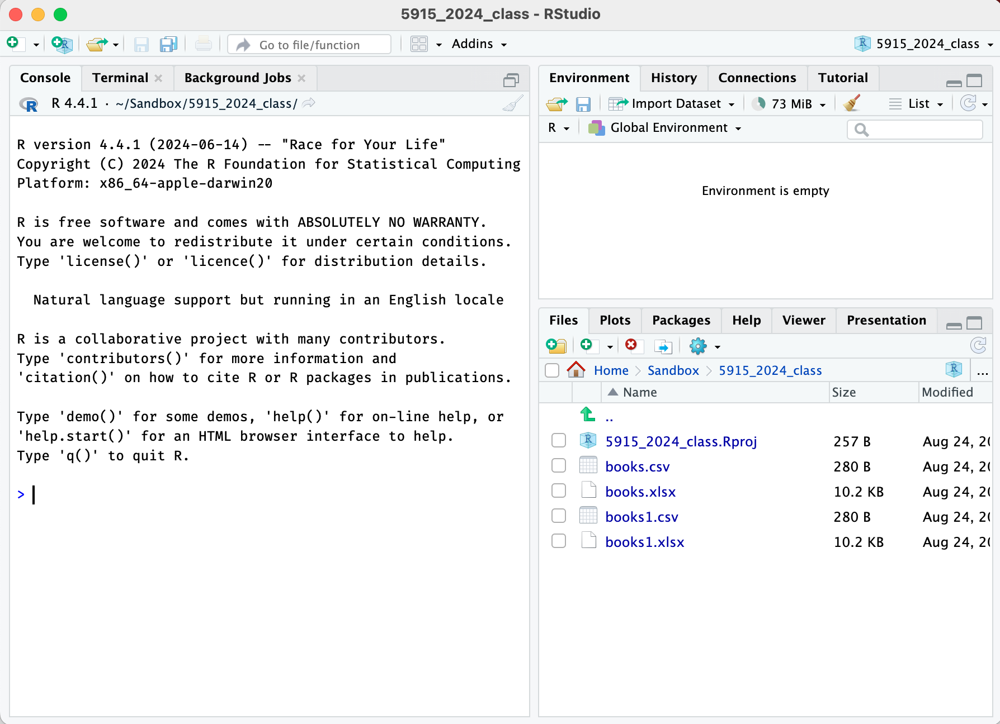
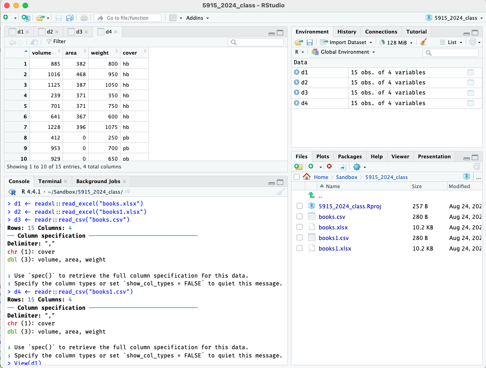

```{r, include = FALSE}
knitr::opts_chunk$set(
  collapse = TRUE,
  comment = "#>"
)
```

```{r setup}
#| include: false
#| message: false
library(conflicted)
library(tidyverse)
library(umncvmstats)
conflicts_prefer(dplyr::select)
```

## Installation and Setup

### Installing R and Rstudio

Download and install both R and Rstudio. See links here:
<https://posit.co/download/rstudio-desktop/>

You need both; "R" is the software underneath that actually does the work; 
"Rstudio" is the interface that makes the doing the work much easier.

For Fall 2025, you should have R version 4.5.1 and Rstudio version 2025.05.1 Build 513.
You can check the version of R by checking the Console pane when you start Rstudio, and the version of Rstudio using Help > About Rstudio. You can also use the following commands in the console.

```{r}
#| eval: false
R.version.string
RStudio.Version()$version
```

### Installing packages

R has many add-on packages that allow one to do more specialized tasks or
make every-day tasks easier. We'll be using a set of packages called the
`tidyverse`, a small helper package called `here`, and a package specifically for this course called `umncvmstats`.

To install them, start Rstudio and run the following lines in the console, one at a time. (The console is in the left pane; we'll do a fuller introduction to the other panes later.) 

Each of these lines will download and install not only the package, but all
other packages that it depends on it, so it can take a while (minutes, not hours).

Preferred option (this uses the new `pak` package installer, but some people have had issues):
```{r}
#| eval: false
install.packages("pak")
pak::pak("tidyverse")
pak::pak("here")
pak::pak("AaronRendahl/umncvmstats")
```

Secondary option (using the `devtools` package for installation):
Note that the `devtools` installation may give you a warning about `Rtools`; this can be ignored.

```{r}
#| eval: false
install.packages("tidyverse")
install.packages("here")
install.packages("devtools")
devtools::install_github("AaronRendahl/umncvmstats")
```


You only need to run these lines once, you do not need to run them every time 
you open R.

However, I may ask you to reinstall the `umncvmstats` package during the semester; it's
possible as the class uses it, we'll find things that need to be updated.

During the semester, it's preferred to do this without updating other packages, as occasionally that will break things; to just update `umncvmstats`, run
```{r}
#| eval: false
devtools::install_github("AaronRendahl/umncvmstats", upgrade="never")
```

#### For updated installations only:
If you had a previous version of R that you recently updated to most recent version,
you should also make sure that all your packages are updated, using this code.

If you just installed R for the first time, this is unnecessary.

```{r}
#| eval: false
update.packages(ask = FALSE, checkBuilt = TRUE)
```

### Setting preferences

There are three important preferences to set.

Under the Tools menu, select Global Options.

- For General (on the left side), and Basic (on the top):

  1. Unselect “Restore .RData into workspace at startup”.

  2. For “Save workspace to .RData on exit” select “Never”.

This preference is important as it prevents R from remembering anything from
session to session. Although that sounds like a good idea, it can make your 
work very difficult to reproduce.

```{r}
#| echo: false
#| fig.alt: Screenshot of the Preferences/General window
#| out.width: "80%"

```

- For "R Markdown" (on the left side),

  3. Unselect "Show output inline for all R Markdown documents".

I suggest you start this way, as that's what I'll demonstrate, but you're welcome
to try inline output and see if you prefer it.

```{r}
#| echo: false
#| fig.alt: Screenshot of the Preferences/R Markdown window
#| out.width: "80%"

```

### File Management

To be able to work with data files and R, you need to be able to be use your
file manager (Finder on Mac) to navigate to files and folders, move and rename files, 
and find and open files you've downloaded.

Let's set up a folder for you to use for all your R code and assignments in this class,
and practice downloading some test files and moving them to this folder. 

Close Rstudio before doing this; these are tasks in your web browser and file manager, not Rstudio.

1. Decide where you want your files for this class to be and use your file manager
to create a new folder there. Computers sometimes have issues with spaces in filenames,
so I recommend using only letters, numbers, and underscores for the name of this folder. For example, `VMED5915_Fall2025`.

2. Within this folder, make a subfolder called "data" to store any data files we'll use.

3. Download the following files and move them to this data subfolder. 
On most systems it will default to saving in a "Downloads" folder; find the file
there and move it to the folder you just created.
You may also be able to use "Save Link As" to save it there directly.
Depending on your setup, you may get a "unsafe link" warning or error, and have to 
specifically allow the download.

+ http://www.stat.umn.edu/~rend0020/5915_data/books1.csv
+ http://www.stat.umn.edu/~rend0020/5915_data/books1.xlsx

4. You also may need to download files from Google Drive. That can be a little different, so let's try that too. Go to this Google Drive folder and download the `books.csv` and `books.xlsx` files, and move them to your class data folder.

+ [Link to Google Drive data folder](https://drive.google.com/drive/folders/1EViFHfhuxpKpte4IQXHoG_Ck_RgUC_rx?usp=drive_link){target="_blank"}

You should now have four test files in your data folder for this class; we'll try opening them later.

### Creating a Project

Now that you have a folder for this class, you need to tell Rstudio that that folder is the one you want to use for everything. In Rstudio, this folder will be called a "project". Using a project really helps with reproducibility, and helps Rstudio find the files it needs to work properly (though it can have trouble with subfolders, so if you want to use subfolders, ask about the `here` package).

* Open Rstudio and go to File > New Project. Then select "Existing Directory" and choose the folder you created for this class (the main one, not the data subfolder).

This will create a new file ending in `Rproj` in the folder you created and open Rstudio in that project folder. Check to make sure it's in the desired project by looking at the upper right corner of Rstudio, it should say the name of your folder there.

In the lower right pane you should also see a list of the files in this folder, which should include the Rproj file that Rstudio just created, along with the data folder you created earlier.

Your R installation should be good to go; we'll confirm that you can open data files properly in the next section.

## Working in R

### Starting R

It's important that every time you start Rstudio to work on things for this class that you open this project file. There's (at least) two ways to do that; you can either use your file manager to find the folder you created and open the Rproj file; assuming your installation worked properly, that should open R within that project. Alternatively, you can use the File > Open Project or File > Recent Projects menus. These can also be found in the upper right where the current project name is shown.

* Try closing Rstudio and reopening it in the project for this class. Check the upper right corner and the files pane to make sure it's open properly.

I recommend one of those methods for opening a project, especially when one has multiple projects. However, if you want to always open in this specific project, use the preference in Tools > Global Options > General > Basic to set the "Restore most recently opened project at setup" option.

### Introduction to the Panes

When you first open Rstudio, you'll see three panes, each with several tabs.

The left pane is for the console; this is where you'll type commands and view text-based output. I expect us to only use this tab in this pane.

The upper right pane is for the "Environment"; this shows a list of the objects that R has in memory at the current time. I expect us to only use this tab in this pane.

The lower right pane is for the "Files" in the current project; this is also where plot-based output will appear (in the "Plots" tab), formatted output will appear (in the "Viewer" tab), and help will appear (in the "Help" tab). You can also see (and install) packages from the "Packages" tab.

When files are opened or data sets are viewed, the console pane will drop to the lower left, and a fourth pane will appear in the upper right, with tabs for the files and data sets.

```{r}
#| echo: false
#| fig.alt: Screenshot of the Rstudio Panes
#| out.width: "100%"

```

### Getting Help

If I've planned this semester properly, all the functions you will need are mentioned in the documentation of the `umncvmstats` package, that is, the files you're reading right now.


For further help, especially about function arguments, we can look up the help file for a specific function using `?`. This works great -- if you happen to remember the name of the function. For example, to get help on the `read_csv` function (which we'll see soon), try typing this in the console:

```{r}
#| eval: false
?read_csv
```

For reference, Rstudio has some "cheat sheets" built in; go to Help > Cheat Sheets.
The ones on the Rstudio IDE, Data Transformation, and Data Visualization are likely to be the most helpful.

### R Basics

Let's start by having R do some basic mathematics; try typing this into the console.

```{r}
1 + 1
```

You'll note the `[1]` at the beginning of the line; this is because in R, everything is a vector (that is, one or more elements long), this is telling you that it's the first element of the vector. Let's use the `:` operator to create a vector so you can see what what happens when the elements span more than one line of output.

```{r}
1:50
```

We'll often want to save the result of an operation. Let's have it save the result of this computation in the variable `a`. Note that it doesn't output anything when a result is saved, to see the result you have to input the variable again. Think of the `<-` as an arrow pointing to the left.

```{r}
a <- 2 + 2
a
```

Because everything in R is a vector, it makes doing arithmetic on more than one element very easy; this adds `a` and `b` together element-wise.
```{r}
a <- 1:5
b <- 10:14
a + b
```

You'll also see the `c` operator used to create vectors, think of it as 'c' for "combine."
```{r}
a <- c(1, 3, 5, 7, 10)
a
```

Most of the time, we'll use R **functions**; for example, the `mean` function. Here let's get the mean of the vector we just made.

```{r}
mean(a)
```

We pass values to a function by putting them in parentheses after the function name; there can be multiple arguments (separated by a comma), and they can be named (by using a single equals sign`=`). For example, if there were missing values (`NA`) in our data, the mean would be undefined, unless we specifically told R to remove the missing values first by setting the `na.rm` argument to `TRUE`. (Best practice is to always write out `TRUE` and `FALSE` with all caps.)

```{r}
a2 <- c(1, 2, 3, 4, NA)
mean(a2)
mean(a2, na.rm=TRUE)
```

We'll also use functions by using the "pipe" operator, `|>`. Think of it as a triangle that sends the thing on the left into the function on the right, as the first argument. Additional arguments can be included too. Note that we still need the parenthesis, whether or not we have additional arguments. This makes it easy to chain results of functions together into new functions.

```{r}
a |> mean()
a2 |> mean(na.rm=TRUE)
```

### Getting unstuck
One can easily get "stuck" in R by giving it only half of an expected pair of delimiters, for example, only an opening `"` or `(`. If this happens, you'll see a `+` at the console instead of a `>`, indicating that R is expecting more input.

If this happens, use [Control-C] to cancel the current input line.

### Loading packages

As mentioned above, R has many add-on packages that extend the basic functionality. You've installed these packages, but you still have to tell R anytime to you want to use one.

A useful analogy may be apps on a phone; after you install an app, you still need to start it -- but you don't have to reinstall it everytime you want to use it.

We use the function `library` to load a package. These lines loads the `tidyverse` and `umncvmstats` libraries.

```{r}
library(tidyverse)
library(umncvmstats)
```

You'll notice that the `tidyverse` library gave you a message about conflicts; what sometimes happens with these add-on packages is that a function name gets used twice. This can cause really weird errors if you expect a version from one package but you get a version from another.

To help with this, I recommend using the `conflicted` package. Let's load it and then try one of the functions that was noted as having a conflict.

```{r}
#| error: true
library(conflicted)
filter()
```

You see that it won't actually do anything, it will instead ask you what you want to do. Usually we'll choose ahead of time which we want like this.

```{r}
conflicts_prefer(dplyr::filter)
```

### Suggestions for this semester

I believe these should be almost all the packages you'll need this semester; this code is in the assignment template.

```{r}
#| eval: false
library(conflicted)
library(tidyverse)
library(umncvmstats)
library(here)
library(readxl)
library(patchwork)
library(gt)
conflicts_prefer(dplyr::filter, dplyr::lag, dplyr::select, umncvmstats::as_gt)
```

- `conflicted`: handles conflicts between packages
- `tidyverse`: set of packages for data manipulation and graphics, includes `ggplot2`
- `umncvmstats`: standardizes syntax and output for statistical functions, also adds various useful functionality
- `here`: helps find files within the project, especially when subfolders are used
- `readxl`: adds functionality for reading Excel files
- `patchwork`: allows multiple graphics to be combined together (eg, side by side)
- `gt`: formatted output for tables

Best practice is to load all packages you're going to use in a particular script or Quarto file at the top.

### Opening data files

First, about specifying file locations, you should always use paths relative to your main project, never absolute paths from your file system. This ensures that your code is reproducible if you move the project around or share your files with others.

To allow files to be found within the project, use the `here` function.

+ If a file `mydata.csv` is in the main project folder, it's just `here("mydata.csv")`.
+ If it's in a subfolder, say, `data`, then it's `here("data", "mydata.csv")`.

We'll now confirm that R can open each of the files you downloaded earlier.
Run the following lines in the console. Running the first two lines, to load the excel files, should result in no output; running the second two lines, to open the csv files, should output the number of rows and columns and the column specification.

```{r, eval=FALSE}
d1 <- readxl::read_excel(here("data", "books.xlsx"))
d2 <- readxl::read_excel(here("data", "books1.xlsx"))
d3 <- readr::read_csv(here("data", "books.csv"))
d4 <- readr::read_csv(here("data", "books1.csv"))
```

In the upper right pane, click on the environment tab, and then click on the names `d1` through `d4` in turn; they should each open a tab in the top left pane to display the spreadsheet. (Be sure to click on the name to open the tab; clicking on the arrow will instead expand a list of the variables, which can also be useful.) They should all have four variables, `volume`, `area`, `weight`, and `cover`.

```{r}
#| echo: false
#| fig.alt: Screenshot of Viewing a Data Set
#| out.width: "100%"

```

Note that you can't edit data directly in Rstudio using this view; this is only for viewing the data set. That might seem odd, but as we'll see, we'll only interact with R using typed commands to ensure reproducibility.

Assuming that worked, you can delete these test files. Use your file manager to do so, and then click the circular arrow in the top right of lower pane (on the Files tab) to update the listing of the files in Rstudio. There's also some rudimentary file operations available in that pane, but not as robust as in your file manager.

Your R/Rstudio setup should now be ready to go!

## Using scripts and Quarto files

### Using scripts

Because all R commands are just plain text, you can save the commands in a plain text file, usually with the extension `.R`. 

In the menus try File > New File > R Script to create a new R script.

It'll open a new untitled file; try typing `1 + 1` into it, and then save it with a filename like `test.R`.

It won't run the commands in the file when you type them; instead you need to send them to the console. Instead of copy/paste (which does work), there's a keyboard shortcut, whatever command you're on will be sent to the console with [Control-Enter] (or also [Command-Enter] on Mac).

This allows you to keep all the commands that you've used to do an analysis, which is essential for reproducibility.

However, it doesn't keep the output; for that, we need to use Quarto.

### About Quarto

A Quarto file is again a plain text file, but it combines your R code with a header with information about your file and any explanatory text you may want to write about it.

You then "render" this Quarto file, which runs the R code and combines it together with your explanatory text into a single output file. By default, this is an html file, though Word and PDF are also possible, though with Word, the formatting is not as consistent and for PDF, more back-end tools are needed (ie, LaTeX).

The explanatory text is written in "Markdown", a plain text format that allows you use to make bold, italic, lists, headers, etc. Rstudio has a visual editor, though, so you don't need to know any of that code. 

### Creating a new assignment

You can get a default Quarto template using File > New File > Quarto Document, but for the purpose of this class, I've developed an alternate template that has more appropriate defaults, and already has code to load the libraries we'll use and to show the version of R you're using.

The following code makes a new file with the file name `yourname_HW01.qmd`, adds the title "Homework 1" at the top, and adds "Your Name" as the author. You should change these as appropriate.

```{r eval=FALSE}
new_assignment("yourname_HW01", "Homework 1", "Your Name")
```

### Using Quarto

#### Rendering a Quarto file
Once you have this new file, "render" it by clicking the Render button at the top of the window. Depending on your settings, it will either open in the Viewer pane or in a new browser window. You can use the arrow icon in the Viewer pane to instead open it in a browser, if that's what you prefer.

#### Visual mode
Try switching between "Source" and "Visual" mode at the top of the window; this allows you to either type the markdown directly or use the visual editor.

#### Adding an R chunk
There are a couple ways to add another R chunk when in visual mode; you can use Code > Insert Chunk, or you can type `/`, which brings up a menu of options.

#### Chunk options
There are a number of chunk options you can set that control the output, among other things; some of the most common is to exclude any messages or warnings from your final rendered file. These are set by lines starting with `#|` at the start of the chunk.

For example, in the assignment template, this line turns off messages when loading packages.

`#| message: false`

Other useful options are `warning: false` to hide warnings, and `echo: false` to only show output, not the code.

See [Quarto reference](https://quarto.org/docs/reference/cells/cells-knitr.html) for more.

#### Trying out R code
You can send R code from an R chunk to the console in exactly the same way as in an R script, by using [Control-Enter].

#### Best practices for reproducibility
When your quarto file is rendered, the chunks are run in order starting at the top, in a fresh R session. This means any code that depends on other code needs to be in the proper order.

One very helpful best practice is to load all the packages you're going to use in a single chunk at the top of the document, as in the assignment template.


